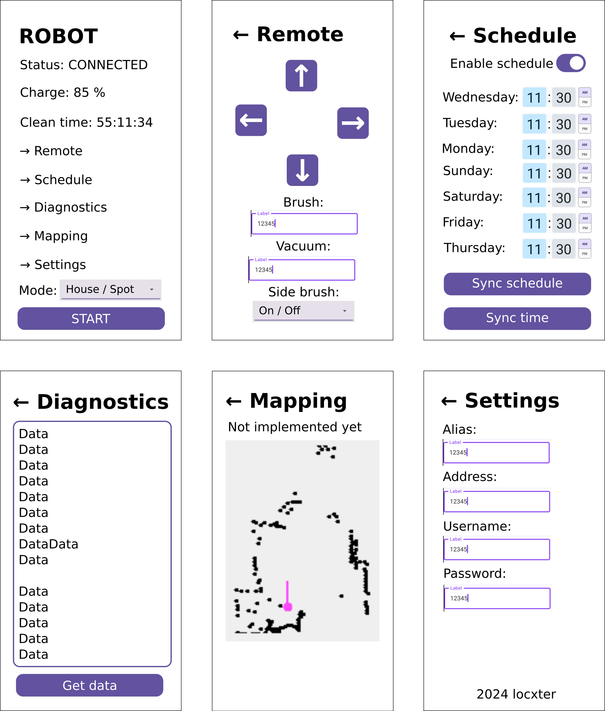

# BotvacCenter

## Overview

> This is a **really early work in progress**. Things aren't final and are due to change over time.

This is a mobile app for controlling and experimenting with Neato Botvac D85 robot vacuums loosely based on btvccntrl-ng. 

## Dependencies

I generally try to minimize dependencies, but I'm a one man crew and can therefore only support Debian-based Linux distributions as I'm running one myself. Anyway, you need to have the following packages installed for everything to work properly:

- SDKMAN! for managing all the JVM dependencies. Install it via the [installation guide](https://sdkman.io/install).
- JDK for running the bytecode. Install it with `sdk install java`.
- Kotlin for developing the program. Install it with `sdk install kotlin`.
- Gradle for building the whole thing. Install it with `sdk install gradle`.
- Android Studio as the necessary IDE for Android development. Install it via the [installation guide](https://developer.android.com/studio/install).
- Kotlin Multiplatform plugin for Android Studio. Install it from [here](https://kotlinlang.org/docs/multiplatform-plugin-releases.html).

## Helpful stuff

- Convert `.png` to `.ico` via `convert file.png -define icon:auto-resize=256,64,48,32,16 file.ico`.
- Convert `.png` to `.icns` via `convert file.png file.icns`.
- Create desktop package via `gradle packageDistributionForCurrentOS`, the final binary will be placed under `composeApp/build/compose/binaries/main/deb`.
- Create Android package by selecting `release` under `Build/Select Build Variant` and then running `Build App Bundle(s) / APK(s)/Build APK(s)`.