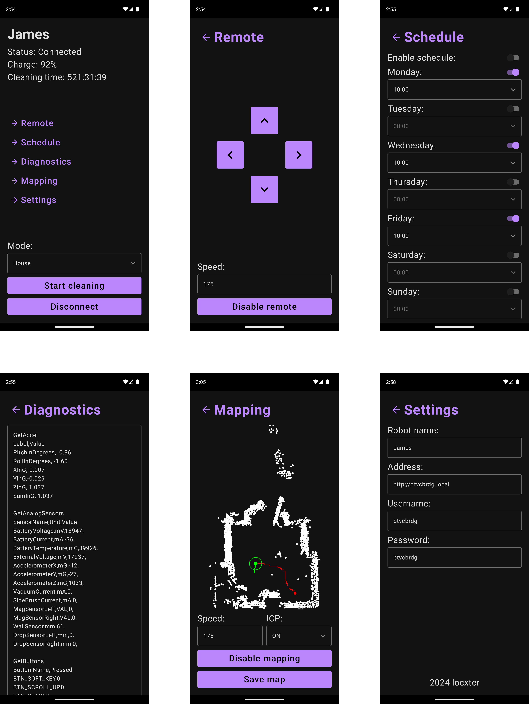

# BotvacCenter

## Overview

> This is an **early work in progress**. Things aren't final and are due to change over time.

This is a Kotlin Multiplatform app for controlling and experimenting with Neato Botvac D85 robot vacuums. It is loosely based on [btvccntrl-ng](https://github.com/locxter/btvccntrl-ng) and focuses on making everyday tasks easier (like setting the clock or starting the robot) as well as exploring SLAM (Simultaneous Localization And Mapping).

**Prebuilt packages for Linux (.deb) and Android (.apk) can be found under [Releases](https://github.com/locxter/BotvacCenter/releases).**

## Features

- [x] Start and stop house or spot cleanings remotely.
- [x] Access crucial statistics (battery charge and total runtime)  at a moments glance.
- [x] Manually drive the robot like a RC car from one location to another.
- [x] Check, modify and enable/disable the cleaning schedule.
- [x] Quickly set the current date and time with a single button press.
- [x] Get extensive diagnostics data for troubleshooting.
- [ ] Easily experiment with SLAM via inbuilt sensors (LIDAR and wheel odometry). 

## Dependencies

I generally try to minimize dependencies, but I'm a one man crew and can therefore only support Debian-based Linux distributions as I'm running one myself. Anyway, you need to have the following packages installed for everything to work properly:

- SDKMAN! for managing all the JVM dependencies. Install it via the [installation guide](https://sdkman.io/install).
- JDK for running the bytecode. Install it with `sdk install java`.
- Kotlin for developing the program. Install it with `sdk install kotlin`.
- Gradle for building the whole thing. Install it with `sdk install gradle`.
- Android Studio as the necessary IDE for Android development. Install it via the [installation guide](https://developer.android.com/studio/install).
- Kotlin Multiplatform plugin for Android Studio. Install it from [here](https://kotlinlang.org/docs/multiplatform-plugin-releases.html).

## How to use it

After modding your Neato Botvac D85 with [btvcbrdg](https://github.com/locxter/btvcbrdg) and writing down its IP address as well as login credentials (username and password), you can immediately run the desktop version via `gradle desktopRun -DmainClass=MainKt --quiet` and enter your specific information in the `Settings` to get started. Alternatively you can create a packaged version of the app via `gradle packageDistributionForCurrentOS` and install that - the final binary will be placed under `composeApp/build/compose/binaries/main/deb`. To run it as an Android app you can either just run a `debug` build in Android Studio's inbuilt emulator, create an Android package by selecting `debug` under `Build/Select Build Variant` and then running `Build App Bundle(s) / APK(s)/Build APK(s)` or build a fully-secure `release` build with your own signing keys via `Build/Generate Signed App Bundle / APK`.

## Helpful stuff

- Convert `.png` to `.ico` via `convert file.png -define icon:auto-resize=256,64,48,32,16 file.ico`.
- Convert `.png` to `.icns` via `convert file.png file.icns`.